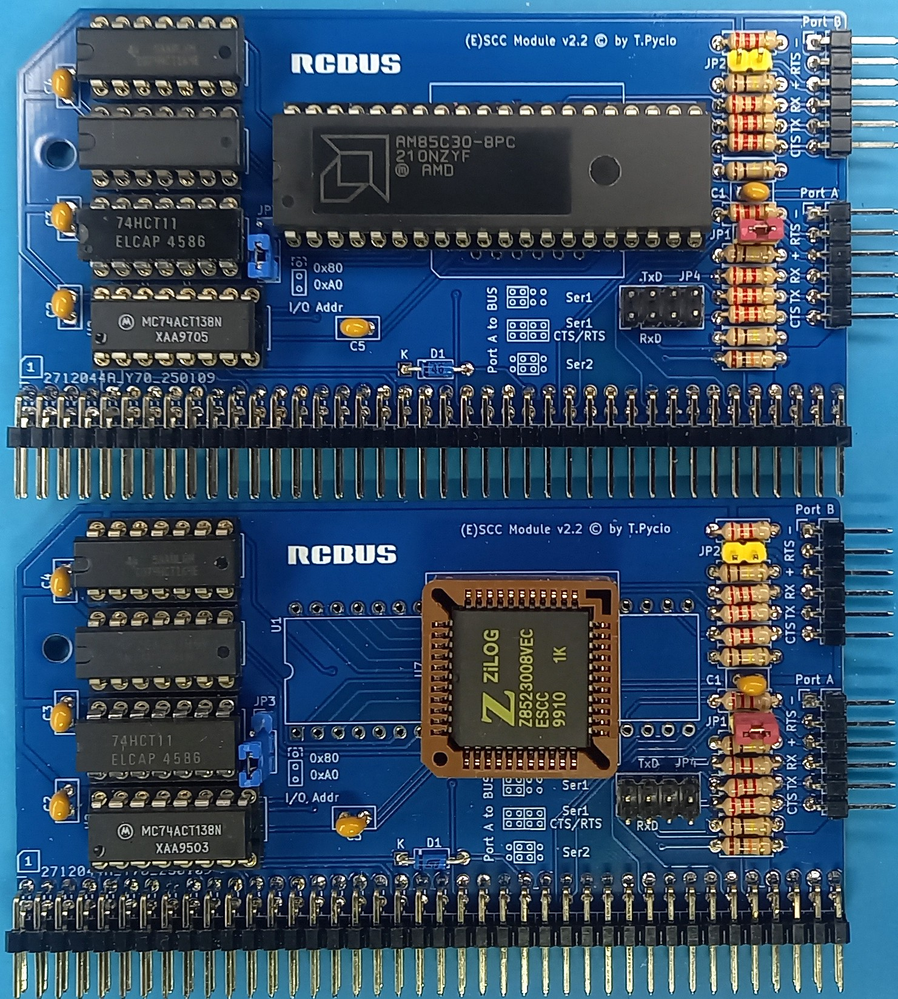

# (E)SCC-module

The Z85C30 or Z85230 modules for RCBus enable the use of the Z80 processor's IM2 vector interrupt chain and DMA channels for transmission. The module allows the use of SCC chips in DIP40 or PLCC44 packages.

## Hardware Documentation

### Schematic

[Schematic - Version 2.2](schematic.pdf)

### Jumpers and Connectors

#### JP1 - USB power from Port1

| Position | Description |
| -------- | ----------- |
| open     | disable     |
| close    | enable      |

External power supply and USB cannot be used at the same time!

#### JP2 - USB power from Port2

| Position | Description |
| -------- | ----------- |
| open     | disable     |
| close    | enable      |

External power supply and USB cannot be used at the same time!

#### JP3 - SCC I/O address select

| Position      | Description       |
| ------------- | ----------------- |
| 1-2           | SCC address: 0x80 |
| 2-3 (default) | SCC address: 0xA0 |

#### JP4 - Link serial port to system bus

| Position                | Description                       |
| ----------------------- | --------------------------------- |
| 1-3 & 2-4               | Bus: Serial 1                     |
| 3-5 & 4-6               | Bus: Serial 2                     |
| 1-3 & 2-4 5-7 & 6-8 | Bus: Serial 1 with CTS/RTS signal |

#### P1 - Serial port A

Connect to USB-to-serial converter.

#### P2 - Serial port B

Connect to USB-to-serial converter.

## Bill of Materials

| Component type     | Reference    | Description                                                        | Quantity |
| ------------------ | ------------ | ------------------------------------------------------------------ | -------- |
| PCB                |              | (E)SCC PCB - Version 2.2                                           | 1        |
| Integrated Circuit | U1 or U7     | Z85C30 or Z85230, DIP40 or PLCC44                                  | 1        |
| Integrated Circuit | U2           | 74HCT138 - 3-to-8 line decoder, 16 pin DIP                         | 1        |
| Integrated Circuit | U3           | 74HCT164 - 8-bit serial-in/parallel-out shift register, 14 pin DIP | 1        |
| Integrated Circuit | U4           | 74HCT11 - Triple 3-input AND gate, 14 pin DIP                      | 1        |
| Integrated Circuit | U5           | 74HCT04 - Hex Inverters, 14 pin DIP                                | 1        |
| Diode              | D1           | Small signal Schottky diodes BAT46, DO35                           | 1        |
| Connector          | S1           | 2x40 pin header, 2.54 mm pitch, angle                              | 1        |
| Connector          | P1,P2        | 6 pin header, 2.54 mm pitch, angle                                 | 2        |
| Pin Header         | JP1,JP2      | 2 pin header, 2.54 mm pitch                                        | 2        |
| Pin Header         | JP3          | 3 pin header, 2.54 mm pitch                                        | 1        |
| Pin Header         | JP4          | 2x4 pin header, 2.54 mm pitch                                      | 1        |
| Capacitor          | C1 - C5      | 0.1 uF, 50V, MLCC, 2.5 mm pitch                                    | 5        |
| Resistor           | R1,R6,R7,R12 | 100 kohm, 0.25 W, axial                                            | 4        |
| Resistor           | R2-R5,R8-R11 | 2.2 kohm, 0.25 W, axial                                            | 8        |
| Resistor           | R13          | 10 kohm, 0.25 W, axial                                             | 1        |
| IC Socket          | U1 or U7     | 40 pin DIP or 44 pin PLCC                                          | 1        |
| IC Socket          | U2           | 16 pin DIP                                                         | 1        |
| IC Socket          | U3 - U5      | 14 pin DIP                                                         | 3        |

[Gerber files](gerber-JLCPCB.zip) prepared for production at JLCPCB

## Release Notes

### Changes

* Version 2.21
  
  * Production files have been corrected.

* Version 2.2
  
  * Initial version
    ATTENTION! The production files lacked the ground connection to the U2 and U4 circuits. Please add them. The damaged production file is no longer available.

## License

Copyright 2026 Tadeusz Pycio

This work is licensed under a [Creative Commons Attribution-NonCommercial 4.0 International (CC BY-NC 4.0) ](https://creativecommons.org/licenses/by-nc/4.0/).
